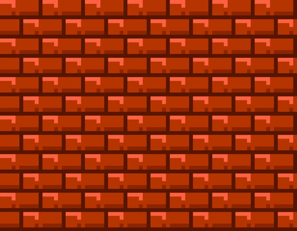

# 🎮 Jogo do Detona Ralph em JavaScript

Um jogo interativo baseado no universo de *Detona Ralph*, desenvolvido com HTML, CSS e JavaScript como parte do curso da Digital Innovation One (DIO).

## 🕹️ Como Jogar
- O Detona Ralph aparece aleatoriamente em um dos 9 quadrados
- Clique nele para marcar pontos
- Você tem **60 segundos** para marcar o máximo de pontos
- O jogo termina automaticamente quando o tempo acabar

## ✨ Funcionalidades
- ⏳ Temporizador regressivo (60s)
- 📊 Contador de pontos em tempo real
- ❤️ Sistema de vidas (3 corações)
- 🔊 Efeitos sonoros ao acertar o alvo
- 🎨 Design temático com estilo arcade

## 🛠️ Tecnologias

- **Google Fonts**: Press Start 2P (fonte pixelada)

🚀 Como Executar
Clone este repositório
Abra o arquivo index.html no seu navegador
Divirta-se!

📝 Créditos
Desenvolvido como projeto do curso da Digital Innovation One
