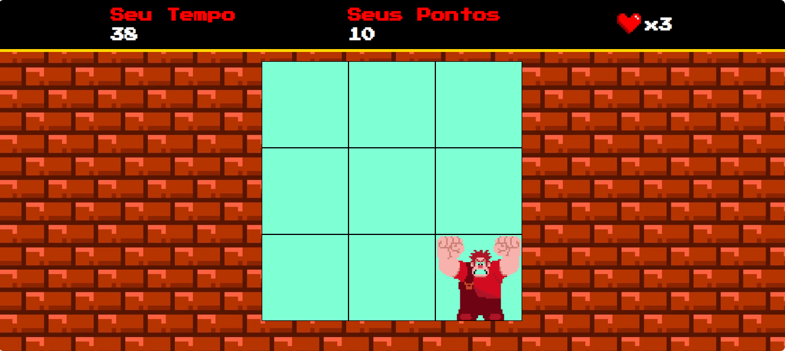

<div align="center">
  <h1>🎮 Jogo do Detona Ralph</h1>
  
  <p>
    Um jogo arcade interativo desenvolvido para praticar conceitos fundamentais de 
    JavaScript, manipulação de DOM e Eventos.
  </p>

  
  
  
  <br><br>

  <a href="https://ederjuniors.github.io/Jogo-do-Detona-Ralph-com-JavaScript">
    
  </a>
</div>

<br>

<div align="center">
  
</div>

<br>

## 📋 Sobre o Projeto

Este projeto foi desenvolvido como parte do bootcamp **Ri Happy - Front-end do Zero (DIO)**. O objetivo foi criar uma versão simplificada do estilo "Whack-a-Mole" (Acerte a Toupeira), onde o jogador deve reagir rapidamente para clicar no personagem antes que ele desapareça.

Embora lúdico, o projeto foca na lógica de **programação assíncrona** e gestão de estados (pontuação, tempo e vidas).

## 🚀 Funcionalidades & Regras

- **Temporizador:** O jogo possui um *countdown* de 60 segundos gerenciado via JavaScript.
- **Sistema de Pontuação:** Incremento em tempo real ao detectar o evento de `mousedown`.
- **Mecânica de Vidas:** O jogador possui 3 vidas.
- **Áudio Dinâmico:** Efeitos sonoros acionados por eventos de clique.
- **Design Arcade:** Estilização visual inspirada em jogos retrô 8-bits.

## 🛠️ Tecnologias e Conceitos Aplicados

Este projeto utiliza a tríade fundamental da web, focando na aplicação prática de lógica de programação:

-  **Estrutura Semântica:** Organização dos elementos do painel e grid do jogo.
-  **Estilização e Animações:** Uso de Flexbox para layout e transições de background.
-  **Lógica do Jogo:**
    - `setInterval()`: Para controlar o tempo de jogo e a aparição aleatória do inimigo.
    - `addEventListener()`: Para capturar a interação do usuário (cliques).
    - `Math.random()`: Para gerar posições imprevisíveis no grid.
    - **Manipulação do DOM**: Seleção e alteração de classes CSS (`classList.add/remove`) dinamicamente.

## 📂 Estrutura do Projeto

```bash
/
├── img/                 # Assets visuais (Personagens, background)
├── sounds/              # Efeitos sonoros (.m4a)
├── src/
│   ├── scripts/
│   │   └── engine.js    # Lógica principal do jogo
│   └── styles/
│       └── main.css     # Estilos globais e responsividade
├── index.html           # Ponto de entrada
└── README.md            # Documentação
```

## 🏁 Como Executar Localmente
Clone o projeto:
```bash
git clone [https://github.com/EderJuniorS/Jogo-do-Detona-Ralph-com-JavaScript.git](https://github.com/EderJuniorS/Jogo-do-Detona-Ralph-com-JavaScript.git)
